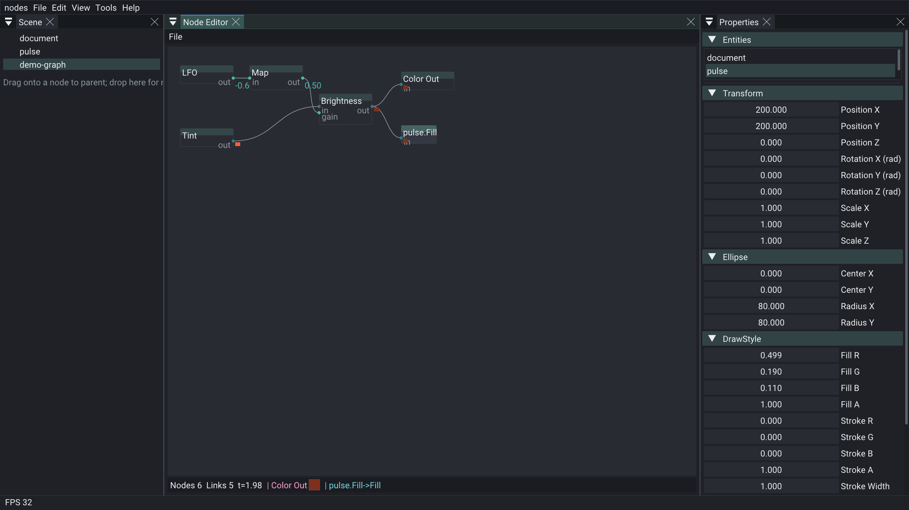

# rigNodeEditor

ImGui node graph editor over **rigNodeComponent** `CNodeGraph`.

Complete built-in catalog: Values, Maths, Modulators, Logic, Vectors, Color, Output — search in **Add node**, typed pins (green/blue/pink), color picker, live eval, Open/Save `.rig`.

Hero seeds a color-wash graph (LFO → Map → Brightness) that tints a scene circle via Color Ref.

**Artist guide:** [docs/nodes.md](https://github.com/rigkid/RigKit/blob/main/docs/nodes.md) (cheatsheet, catalog, recipes).

[API/docs](https://rigkid.github.io/rigNodeEditor/)
